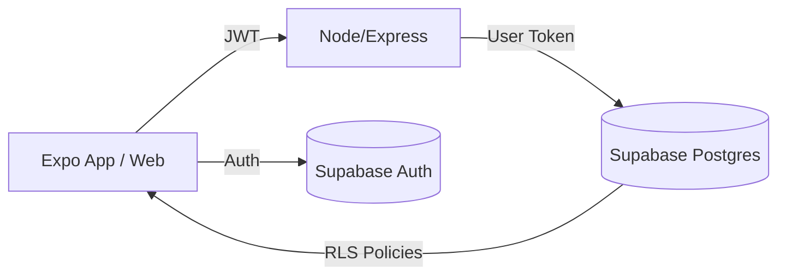

# Arquitetura de Microserviços (Projeto 2)

Este guia utiliza o projeto **BusinessFlow** como referência para arquiteturas modulares e microserviços.

## 🏗️ Visão Geral da Arquitetura

O Projeto 2 segue uma abordagem moderna utilizando **Supabase** como Backend-as-a-Service (BaaS) e orquestrador de dados, permitindo que múltiplos clientes (Web, Mobile, Microserviços) interajam de forma segura.



### Componentes Principais
1.  **Apps (Frontend/Mobile)**: React Native (Expo) ou React Web.
2.  **API Services**: Node.js/TypeScript para lógica de negócios complexa.
3.  **Supabase**: Autenticação, Banco de Dados (Postgres) e Realtime.

## 🚀 Como Iniciar (Monorepo)

O projeto é estruturado como um Monorepo.

### 1. Estrutura de Pastas
```text
BusinessFlow/
├── apps/
│   ├── api/       # Serviço de API (Node/Express)
│   └── mobile/    # App Mobile (Expo)
├── supabase/      # Migrations e Configurações
└── docs/          # Documentação Técnica
```

### 2. Configuração do Ambiente
Copie os arquivos de exemplo `.env.example` para `.env` em cada sub-projeto (`apps/api` e `apps/mobile`).

### 3. Executando a API
```bash
cd apps/api
npm install
npm run dev
```

### 4. Executando o Mobile App
```bash
cd apps/mobile
npm install
npx expo start
```

## 🔒 Boas Práticas (Row Level Security)
Ao desenvolver novos serviços, **sempre** utilize Row Level Security (RLS) no banco de dados.
- O serviço deve encaminhar o token do usuário para o banco.
- Nunca utilize a `service_role` (admin key) para operações iniciadas por usuários comuns.
